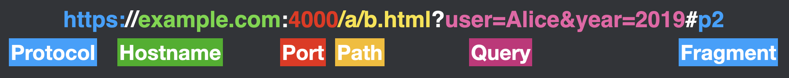

# Lesson 2: Fundamentals: HTML and JavaScript

## Introduction

The web platform combines several technologies that work together to create interactive applications that run in the browser. Before diving into web security, we need to understand these core technologies: HTML for structure, URLs for addressing resources, CSS for styling, and JavaScript for programming behavior.

## HTML: The Web's Structure

HTML (HyperText Markup Language) provides the structure and content of web pages using a system of tags that describe different types of content. Each piece of content is wrapped in opening and closing tags that describe its role in the document.

For example, this text document:

```
Introduction

This article discusses penguins. Recent research makes three claims about penguin diet:

First, penguins prefer tropical fruits
Second, these fruits affect their smell
```

Can be marked up with HTML to indicate its structure:

```html
<h1>Introduction</h1>

<p>
  This article discusses penguins. Recent research makes three claims about
  penguin diet:
</p>

<ul>
  <li>First, penguins prefer tropical fruits</li>
  <li>Second, these fruits affect their smell</li>
</ul>
```

A complete HTML document includes additional required structure:

```html
<!doctype html>
<html lang="en">
  <head>
    <meta charset="utf-8">
    <title>Article About Penguins</title>
  </head>
  <body>
    <!-- Content goes here -->
  </body>
</html>
```

### Key HTML Tags for Security Context

Several HTML tags are particularly relevant for this course:

1. `<script>` - Executes JavaScript code
   ```html
   <!-- Load an external script -->
   <script src="/path/to/code.js"></script>

   <!-- Include inline code -->
   <script>
     alert('Hello!')
   </script>
   ```

2. `<iframe>` - Embeds another webpage
   ```html
   <iframe src="https://example.com"></iframe>
   ```

3. `<form>` - Submits data to servers
   ```html
   <form action="/submit" method="POST">
     <input name="username" />
     <button>Submit</button>
   </form>
   ```

4. `<a>` - Creates links between pages
   ```html
   <a href="https://example.com">Link text</a>
   ```

## URLs: Web Addressing

URLs (Uniform Resource Locators) specify how to find resources on the web. They have several components:



- Protocol (e.g., `http://` or `https://`)
- Hostname (e.g., `example.com`)
- Port (optional, e.g., `:443`)
- Path (e.g., `/blog/post`)
- Query string (e.g., `?id=123&user=alice`)
- Fragment (e.g., `#section1`)

URLs can be specified in several ways:

1. Full URL: `https://example.com/news/2024/`
2. Protocol-relative: `//example.com/news/2024/` (inherits protocol from current page)
3. Root-relative: `/news/2024/` (relative to domain root)
4. Path-relative: `2024/` (relative to current path)

This flexibility in URL specification becomes relevant for security when considering how browsers resolve URLs and enforce security boundaries.

## CSS: Visual Styling

CSS (Cascading Style Sheets) controls the visual presentation of HTML elements. While CSS itself isn't a major source of security vulnerabilities, understanding how it's included in pages is important:

```html
<!-- External stylesheet -->
<link rel="stylesheet" href="/styles.css">

<!-- Internal stylesheet -->
<style>
  body { color: blue; }
</style>

<!-- Inline styles -->
<p style="color: red;">Text</p>
```

CSS can be used for security exploits when combined with other vulnerabilities, particularly in cases where attackers can inject styles that affect page layout or visibility.

## JavaScript: Programming the Web

JavaScript allows websites to be interactive and dynamic. It can:

- Modify the page content (DOM manipulation)
- Respond to user actions (event handling)
- Make network requests (AJAX/fetch)
- Store data locally (localStorage/cookies)
- Run computational tasks

### Including JavaScript

JavaScript can be included in HTML documents in several ways:

```html
<!-- External script -->
<script src="/code.js"></script>

<!-- Inline script -->
<script>
  document.body.style.backgroundColor = 'blue';
</script>

<!-- Inline event handlers (not recommended) -->
<button onclick="alert('clicked')">Click me</button>
```

## Security Implications

These fundamental technologies create several security considerations that we'll explore in detail in subsequent lessons:

1. **Content Isolation**: How browsers prevent one website from interfering with another
2. **Code Execution**: How JavaScript's abilities are constrained by the browser
3. **Data Access**: How websites can access and store user data
4. **Cross-Origin Requests**: How browsers control communication between different websites

Later lessons will build on these fundamentals to explain specific vulnerabilities and their mitigations.
