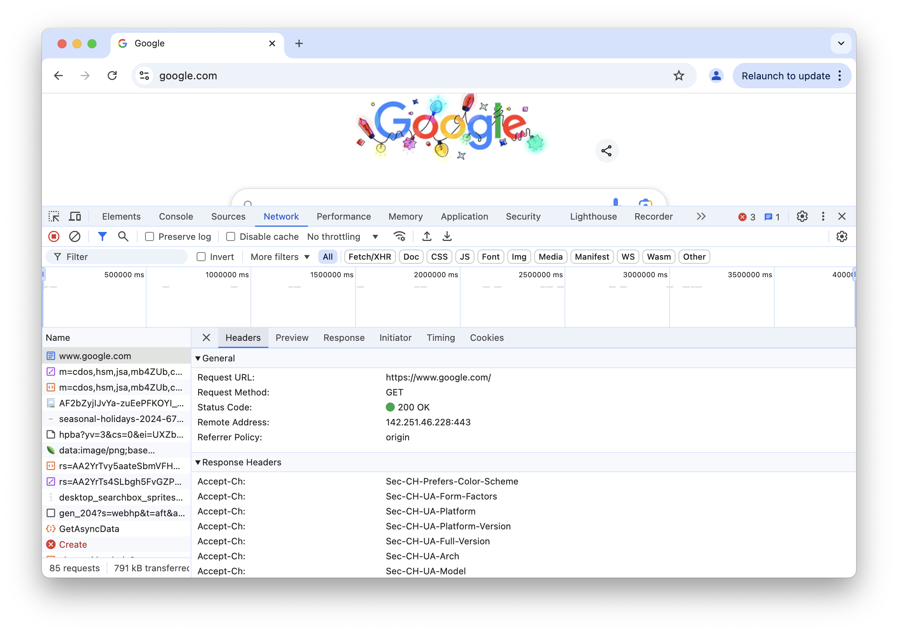
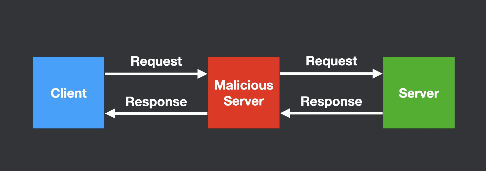

# Lesson 3: Fundamentals of IP, DNS, and HTTP

## Introduction

This lesson covers three core technologies that make the web possible: IP addresses, DNS (Domain Name System), and HTTP (Hypertext Transfer Protocol). These technologies work together to enable every web interaction, from loading a simple webpage to streaming video content.

## 1. IP Addresses: The Internet's Street Addresses

### What are IP Addresses?

Just as physical addresses identify buildings, IP addresses identify devices on the internet. Every device needs a unique IP address to communicate with other devices. For example, `45.79.112.203` is an IP address that identifies a specific server on the internet.

### Demonstration

Let's see IP addresses in action by connecting to `45.79.112.203`. This IP address is the server that runs [tcpbin.com](https://tcpbin.com), which is an echo service that returns any text you send to it. In a terminal, try running the following:

```
nc 45.79.112.203 4242
```

This will open a connection to the remote server. Type some text and hit "enter"; the text will be sent to tcpbin. Then, tcpbin will reply to you with the same text.

<video autoplay loop controls title="Screen capture of a terminal running 'nc tcpbin.com 4242', sending text and displaying the echoed response">
<source src="./lec01-tcpbin.mp4" />
</video>

Here are the network messages being sent behind the scenes:

<video autoplay loop controls title="Animated diagram showing the requests and responses that are sent in the above tcpbin demo">
<source src="./lec01-tcpbin-diagram.mp4" />
</video>

## 2. DNS: The Internet's Address Book

While computers work with IP addresses, humans prefer memorable names. DNS translates human-friendly domain names (like google.com) into IP addresses (like 142.251.46.206). This translation happens automatically every time you visit a website.

<video autoplay loop controls title="Animated diagram shows a client sending a DNS resolution request for 'google.com' and receiving a response for the IP '142.251.46.206'">
<source src="./lec01-dns-basic.mp4" />
</video>

### How DNS Works

When you type a domain name into your browser, your computer contacts a "DNS recursive resolver" to find the corresponding IP address. The resolver follows a chain of several "authoratative nameservers." For example, to resolve an IP address for `google.com`:

1. A hardcoded [root nameserver](https://www.iana.org/domains/root/servers) responds with the IP of a nameserver authorized to resolve `.com` domains
2. That nameserver responds with the IP of a nameserver authorized to resolve `google.com` domains
3. That nameserver responds with the final IP address for `google.com`

<video autoplay loop controls title="Animated diagram shows a client sending a DNS resolution request for 'google.com'. The DNS recursive resolver then queries the root nameserver, .com nameserver, and google.com nameserver.">
<source src="./lec01-dns-recursive.mp4" />
</video>

## 3. HTTP: The Web's Spoken Language

Once we have resolved the IP address of the server that we wish to talk to, we can request web pages, images, and other content from that server. However, we need to establish a standard language so that communicating machines can understand each other, even if they are run by different organizations and using different operating systems and browsers.

HTTP (HyperText Transport Protocol) is a standard protocol that defines how web browsers and servers communicate. Proper HTTP communication is described by [a lengthy specification](https://www.rfc-editor.org/rfc/rfc9110.html), but the core of the protocol is very simple to understand.

### HTTP requests

A basic HTTP request has a _request line_, one or more _request headers_, and then a blank line signalling the end of the request. For example:

```
GET / HTTP/1.1
Host: www.google.com
User-Agent: Mozilla/5.0 (Macintosh; Intel Mac OS X 10.15; rv:133.0) Gecko/20100101 Firefox/133.0
Accept-Language: en-US,en

```

The request line specifies:

* A [*request method*](https://developer.mozilla.org/en-US/docs/Web/HTTP/Methods), e.g. GET for fetching data or POST for uploading or modifying data
* A *URL path* indicating the resource we are requesting
* The HTTP protocol version


The [_request headers_](https://developer.mozilla.org/en-US/docs/Glossary/Request_header) are used to indicate supplemental information about the request, such as which browser is being used, which language/locale is preferred, etc.

### HTTP responses

The server responds with a status line, headers, and content:
```
HTTP/1.1 200 OK
Content-Type: text/html
Date: Wed, 11 Dec 2024 03:48:35 GMT

<!doctype html>
<html>
  ...
</html>
```

The _response line_ specifies:

* The HTTP protocol version
* An HTTP [_status_](https://developer.mozilla.org/en-US/docs/Web/HTTP/Status)


Like request headers, the [_response headers_](https://developer.mozilla.org/en-US/docs/Glossary/Response_header) contain metadata about the response.

### Observing HTTP in action

Most browsers include tools to view network traffic, such as [Chrome's DevTools](https://developer.chrome.com/docs/devtools/network). You can use these tools to view the HTTP requests that your browser makes:



You can also view the raw request and response by sending requests using the command-line utility `curl`:

```
$ curl -v https://www.google.com
> GET / HTTP/2
> Host: www.google.com
> User-Agent: curl/8.7.1
> Accept: */*
>
* Request completely sent off
< HTTP/2 200
< date: Fri, 13 Dec 2024 00:43:53 GMT
< expires: -1
< cache-control: private, max-age=0
< content-type: text/html; charset=ISO-8859-1
< content-security-policy-report-only: object-src 'none';base-uri 'self';script-src 'nonce-ACpMGlNv3pFD1rpGQgWfIg' 'strict-dynamic' 'report-sample' 'unsafe-eval' 'unsafe-inline' https: http:;report-uri https://csp.withgoogle.com/csp/gws/other-hp
< accept-ch: Sec-CH-Prefers-Color-Scheme
< p3p: CP="This is not a P3P policy! See g.co/p3phelp for more info."
< server: gws
< x-xss-protection: 0
< x-frame-options: SAMEORIGIN
< set-cookie: AEC=AZ6Zc-XuLZ1Fsh9XHJlpUxu_XBkIdrxJ2tYcTc7xfioKV9su4PAWPTlcBS4; expires=Wed, 11-Jun-2025 00:43:53 GMT; path=/; domain=.google.com; Secure; HttpOnly; SameSite=lax
< set-cookie: NID=520=n2eoYDYjs-OUxSr3yvGPPaI8_L7EfLZnY3we0inOrimwxwkMj2_mbyA6ykGlHVk2PZBPZ3FvlTzcEFf2R2GfMjy99Z1tX1gYx0dgM4Ng2q33WvZRwqtMJpzWoyG5xeaNiqZ-z_iaIDhNqcMGE3aBZ9GLJweFMPtC8WotyfGpjio47y2GbuaAY5xw4UIJZz5liDRGGyS7HA; expires=Sat, 14-Jun-2025 00:43:53 GMT; path=/; domain=.google.com; HttpOnly
< alt-svc: h3=":443"; ma=2592000,h3-29=":443"; ma=2592000
< accept-ranges: none
< vary: Accept-Encoding
<
<!doctype html><html itemscope="" itemtype="http://schema.org/WebPage" lang="en"><head><meta content="Search the world's information, including webpages, images, videos and more. Google has many special features to help you find exactly what you're looking for." name="description">
...
```

In fact, since HTTP is based on simple plain text, you can speak it to talk directly to servers yourself! Run `nc google.com 80` to open a connection to Google, and then type the following (be sure to hit enter _twice_ at the end):

```
GET / HTTP/1.1
Host: www.google.com

```

<video autoplay loop controls title="Screen recording of sending an HTTP request to Google via nc">
<source src="./lec01-nc-http.mp4" />
</video>

### Key Characteristics of HTTP

In summary, HTTP is:
- Simple: based on human-readable text
- Extensible: can add new headers as needed
- Transport agnostic: requires only reliable transport
- Stateless: each request is independent
  - Servers maintain state through additional mechanisms like cookies
  - The protocol itself doesn't track state between requests

## Putting It All Together

Here's how these technologies work together when loading a webpage:

<video autoplay loop controls title="Animated diagram illustrating the network requests involved in a full web page load">
<source src="./lec01-all-together.mp4" />
</video>

1. DNS resolves the domain name to an IP address
2. Your browser sends an HTTP request to that IP
3. The server returns the HTML content
4. Your browser requests additional resources (CSS, images, etc.)

## Web protocol security

### DNS Hijacking

DNS hijacking occurs when attackers redirect DNS queries to malicious servers. For example, an attacker might seek to direct `bankofamerica.com` requests to an IP address under their control, instead of the real Bank of America server. There are several ways that this attack can happen:

1. **Compromised DNS recursive resolvers or nameservers:** When attackers gain control of DNS infrastructure, they can modify the responses sent to users.
1. **Stolen DNS provider credentials:** Attackers who obtain login credentials for DNS management accounts can modify the DNS records that the authoratative nameservers send.
1. **Malware that changes local DNS settings:** Some malware specifically targets DNS configuration on users' local devices. By changing these settings, the malware causes infected devices to use attacker-controlled DNS recursive resolvers instead of the default recursive resolver.
1. **Compromised routers:** Home and office routers often serve as default DNS recursive resolvers for local networks. If attackers compromise a router, they can modify its DNS responses.

<video autoplay loop controls title="Animated diagram illustrating how a DNS hijacking attack works via a hijacked DNS resolver">
<source src="./lec01-dns-hijacking.mp4" />
</video>

Recent studies show the prevalence of these attacks:


On the server side, DNS hijacking attacks are best mitigated using [DNSSEC](https://www.cloudflare.com/learning/dns/dnssec/how-dnssec-works/). On the client side, using [DNS over HTTPS](https://developers.cloudflare.com/1.1.1.1/encryption/dns-over-https/encrypted-dns-browsers/) also helps to mitigate some forms of attack.

### Man-in-the-Middle Attacks

A Man-in-the-Middle (MitM) attack occurs when an attacker secretly intercepts and potentially modifies communication between two parties who believe they are directly communicating with each other.

There are several common ways MITM attacks can be executed:

1. **Network eavesdropping:** When users connect to public WiFi networks (like in coffee shops or airports), attackers on the same network can intercept unencrypted traffic between users and web servers.

2. [**ARP spoofing:**](https://www.crowdstrike.com/en-us/cybersecurity-101/social-engineering/arp-spoofing/) Attackers can send fake Address Resolution Protocol (ARP) messages on a local network, tricking devices into sending traffic through the attacker's machine instead of the legitimate router.

3. **Evil twin attacks:** Attackers set up rogue WiFi access points that mimic legitimate ones (e.g., "Starbucks_WiFi" vs the real "Starbucks WiFi"), hoping users will connect to their malicious network.



HTTP is an _unencrypted_ and _unauthenticated_ protocol, so it offers no protections against MitM attacks. Once attackers have established themselves in the middle, they can:

- Read sensitive information in unencrypted traffic (passwords, credit card numbers, etc.)
- Modify requests or responses to inject malicious content
- Capture authentication tokens or session cookies
- Present fake versions of websites to steal user credentials

The best protection against MitM attacks is to use [HTTPS/TLS](https://www.cloudflare.com/learning/ssl/transport-layer-security-tls/), which is an additional layer underneath HTTP that provides encryption and identity validation.
