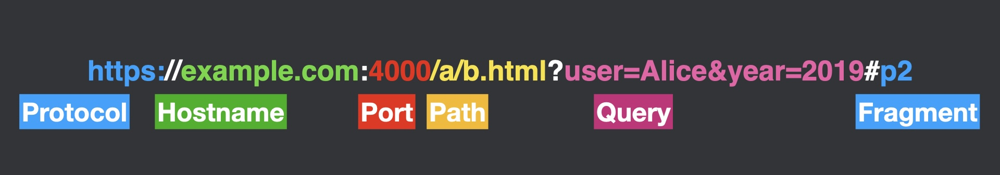

# Lesson 4: The Same-Origin Policy

## Introduction

The Same-Origin Policy (SOP) is the fundamental security model of the web. It defines how different web pages can interact with each other, acting as a crucial security barrier that prevents malicious websites from interfering with legitimate ones.

Obviously, we need some degree of isolation between websites. It shouldn't be possible for a malicious website to get your bank credentials and steal all your money just because you clicked on a shady link. However, enabling _some_ interactions between sites is what makes the internet so dynamic and exciting:

* Our site should be able to link to [MDN](https://developer.mozilla.org/en-US/docs/Web/HTML) to direct you to resources if you are interested in learning more
* A music blog should be able to embed content from YouTube, Spotify, or SoundCloud
* A food blog might want to generate and display maps from Google Maps with pins showing the locations of restaurants to visit; that site needs to tell Google a list of coordinates to pin on the map
* An e-commerce website may want to embed a Stripe or Paypal payment widget in order to facilitate payment without the merchant getting credit card info; this site must embed a payment interface from Stripe and also be able to receive confirmation of payment once the customer has successfully checked out

Drawing a line between "okay" and "not okay" interactions is not easy.

In addition, we must also define what constitutes a "site". Should pages under `medium.com/@alice/` be considered under the same site as `medium.com/@bob/`, even though they are published by different people using Medium as a publishing platform? Should content under `reddit.com` be considered a different site from content under `redd.it`, even though they are run by the same company?

The Same-Origin Policy defines the answers to these questions. Although it may be somewhat arbitrary in how it draws the lines between "sites," and you may be dissatisfied with the answers to the above questions, the Same-Origin Policy is essential to define a universal security boundary between sites that all browsers enforce.

## What is an Origin?

A [URL](https://developer.mozilla.org/en-US/docs/Learn/Common_questions/Web_mechanics/What_is_a_URL) may have several components: a protocol, hostname, port, path, query, and fragment:



Many different URLs would fall under the umbrella of a website. The term "site" isn't specifically defined, and reasonable people might disagree about where the boundary of a "site" is, so let's define "origin" as a specific technical term.

An origin is defined by three components:

1. Protocol (e.g., http:// or https://)
2. Hostname (e.g., example.com)
3. Port number (e.g., :443)

For example, in the URL `https://example.com:443/path/page.html`:

- Protocol: `https://`
- Hostname: `example.com`
- Port: `443`

Note that the path (`/path/page.html`) is NOT part of the origin.

Two URLs have the same origin only if ALL three components match exactly. Here are some examples:

```
https://example.com/a/      →  https://example.com/b/       ✅ Same origin
https://example.com/        →  http://example.com/          ❌ Different protocol
https://example.com/        →  https://www.example.com/     ❌ Different hostname
https://example.com/        →  https://example.com:8080/    ❌ Different port
```

## Isolation between origins

The same-origin policy states that a webpage from one origin should not be able to access or interfere with content from another origin. However, this seemingly simple rule becomes complex in practice.

Let's examine what different types of cross-origin interactions are allowed:

1. Links: Can origin A link to origin B? ✅ YES
   - This is fundamental to how the web works
2. Embedding: Can origin A embed origin B? ✅ YES
   - Origins can embed other origins using [iframes](https://developer.mozilla.org/en-US/docs/Web/HTML/Element/iframe) (e.g. you can embed `youtube.com` in your site)
   - However, they cannot access the embedded origin's content via JavaScript! Origin A should never be able to determine anything about what is displayed in the Origin B iframe. Otherwise, a malicious site could embed your bank and see what is displayed.
3. Forms: Can origin A submit forms to origin B? ✅ YES
   - This historical exception enables cross-origin form submissions
   - But creates security risks (like CSRF attacks, which we will discuss later)
4. Resources: Can origin A load resources from origin B? ✅ YES
   - Images: ``
   - Stylesheets: `<link href="https://origin-b.com/styles.css">`
   - Scripts: `<script src="https://origin-b.com/script.js">`
5. Data Access: Can origin A read data from origin B? ❌ NO
   - JavaScript cannot send `fetch` requests to other origins (or any other type of asynchronous request)
   - JavaScript cannot view the contents of images, iframes, or any other resources from other origins
   - This policy prevents sensitive data leakage.
6. Modification: Can origin A modify origin B's content? ❌ NO
   - If origin B is embedded in an iframe within origin A, origin A cannot modify anything in that iframe. Even adjusting CSS styles to make origin B match origin A's style is forbidden.
   - For example, this code would fail:
     ```
     const iframe = document.createElement('iframe');
     iframe.src = 'https://other-site.com';
     document.body.appendChild(iframe);

     // This will fail - cannot access cross-origin content
     iframe.contentDocument.body.style.backgroundColor = 'red';
     ```

## When the Policy is Too Broad

Sometimes the same-origin policy isn't restrictive enough, particularly when different people control different path prefixes under the same domain.

For example, `https://medium.com/@alice/good-page` and `https://medium.com/@bob/evil-page` are under the same origin. Medium mitigates the security risk by severely limiting the content that users can upload (e.g. users cannot add arbitrary javascript to their Medium posts). However, many universities host student-uploaded content with the same URL structure, and `https://university.edu/~professor1/gradebook` and `https://university.edu/~student/evil` may both contain arbitrary content. Website administrators need to be aware of these risks, and they must design sites with the Same-Origin Policy in mind.

## When the Policy is Too Narrow

Sometimes the same-origin policy is too restrictive for legitimate use cases. For example:

* `accounts.google.com` needs to handle authentication for `www.google.com`, `mail.google.com`, `www.youtube.com`, and more.
* `maps.googleapis.com` [provides services](https://developers.google.com/maps/documentation/api-picker) for *any* website to query the human-readable postal address for latitude/longitude coordinates, calculate the transit time between too coordinates, and more. Arbitrary origins need to be able to read these responses using JavaScript.

## Relaxing the Same-Origin Policy

### document.domain

*WARNING: Don't use this, for reasons described below.*

The `document.domain` property allows subdomains of the same domain (e.g. `login.example.com` and `shop.example.com`) to opt into sharing an origin by setting their domain to a common parent domain:

```javascript
// On login.example.com
document.domain = "example.com";

// On shop.example.com
document.domain = "example.com";

// Now they can interact as if same-origin
```

Important rules about `document.domain`:
- Both origins must explicitly opt-in by setting the property. If `subdomain.parent.com` sets `document.domain = "parent.com"`, but `parent.com` does not _explicitly_ set `document.domain`, the sharing will not work.
- You can only set `document.domain` to a parent domain of the current domain. The origin `evil.com` can't set `document.domain = "google.com"`.
- Both origins must set it to exactly the same value.

Example scenarios:

| Origin URL | document.domain | Target URL | Target's document.domain | Allowed? |
|------------|----------------|------------|-------------------------|-----------|
| http://www.example.com/ | "example.com" | http://payments.example.com/ | "example.com" | ✅ Yes |
| http://www.example.com/ | "example.com" | https://payments.example.com/ | "example.com" | ❌ No - Protocol mismatch |
| http://payments.example.com/ | "example.com" | http://example.com/ | (not set) | ❌ No - Target must opt-in |

⚠️ WARNING: This mechanism is dangerous because _any_ subdomain can opt into the shared origin. If `login.example.com` and `shop.example.com` both set `document.domain = "example.com"`, and an attacker is able to somehow gain control of e.g. `evil.obscure.subdomain.example.com`, he can also set `document.domain = "example.com"` and gain access to sensitive data. For this reason, `document.domain` is being deprecated in modern browsers.

### The postMessage API

The [`postMessage` API](https://developer.mozilla.org/en-US/docs/Web/API/Window/postMessage) provides a secure channel for cross-origin communication between tabs, windows, and iframes. For example, if Origin A embeds Origin B in an `iframe`, we may run the following:

```javascript
// Origin A: Sending a message
iframe.contentWindow.postMessage(data, 'https://origin-b.com');

// Origin B: Receiving messages
window.addEventListener('message', (event) => {
  // Always verify the sender's origin
  if (event.origin !== 'https://origin-a.com') return;

  // Handle the message
  console.log(event.data);
});
```

Origin B (in the iframe) may also communicate to Origin A (the parent):

```javascript
// Origin A: Receiving messages
window.addEventListener('message', event => {
  if (event.origin !== 'https://origin-b.com') return;
  console.log(event.data);
})
// Origin B: Sending a message
window.parent.postMessage(data, 'https://origin-a.com');
```

This may be used to safely exchange a wide variety of data between origins.

As an example, `shop.example.com` may want to display the name of a logged-in user. It can register a listener for messages:

```javascript
window.addEventListener('message', event => {
  if (event.origin !== 'https://login.example.com') return;
  setCurrentUser(event.data.name)
})
```

Then, it can embed an iframe to `https://login.example.com/currentUser` which runs:

```javascript
const data = { name: 'Bob Smith' }
window.parent.postMessage(data, 'https://shop.example.com')
```

⚠️ WARNING: `message` listeners must always validate the source origin of messages. Otherwise, an attacker website `evil.com` could embed `shop.example.com` and send it a `postMessage` message with false information, causing incorrect information to be displayed.

Similarly, when _calling_ `postMessage`, senders must always specify the intended destination origin. Otherwise, an attacker website `evil.com` could embed `login.example.com`, and if that code did not properly set `https://shop.example.com` as the destination origin, then it would send the authentication state to `evil.com`, resulting in data exfiltration.

### Cross-Origin Resource Sharing (CORS)

Cross-Origin Resource Sharing (CORS) is a standardized way for servers to relax the same-origin policy for their resources. Unlike `document.domain` or `postMessage`, CORS is specifically designed for HTTP requests (like API calls or fetching resources).

As a specific example, let's imagine that we are building a website `example.com` that wants to display street addresses for some latitude/longitude coordinates. Google provides a [service](https://developers.google.com/maps/documentation/geocoding/overview) that allows us to send an HTTP request with latitude/longitude coordinates, and they will respond with a human-readable street address. We might use that service like this:

```javascript
// On https://example.com
fetch('https://maps.googleapis.com/maps/api/geocode/json?address=1600+Amphitheatre+Parkway,+Mountain+View,+CA&key=YOUR_API_KEY')
  .then(response => response.json())
  .then(data => {
    console.log('Geocoding results:', data);
  })
  .catch(error => console.error('CORS error:', error));
```

However, according to the Same-Origin Policy, we would not be able to read the results of this request, because `https://example.com` and `https://maps.googleapis.com` are different origins.

In order to allow this behavior, the operators of `https://maps.googleapis.com` must explicitly allow our origin to read the response by sending a CORS `Access-Control-Allow-Origin` HTTP response header in their response:

```http
HTTP/1.1 200 OK
Content-Type: application/json
Access-Control-Allow-Origin: https://example.com
... other HTTP response headers ...

{
  "results": [
    ...
  ]
}
```

A server may also return `Access-Control-Allow-Origin: *` to allow *any* origin to read its responses. This disables the Same-Origin Policy for those responses, so it should be used with caution.

⚠️ WARNING: The Same-Origin Policy prevents an origin from *reading* the response from a different origin without the necessary CORS headers. However, it does not prevent *sending* the request. For example, an attacker could embed this code:

```javascript
// On attacker.com
fetch('https://api.bank.com/transfer', {
  method: 'POST',
  credentials: 'include',
  body: JSON.stringify({
    to: 'attacker',
    amount: '1000000'
  })
});
```

Even if the response does not include CORS headers in the response, and even though `attacker.com` will not be able to view the response information, any side effects resulting from this request will still take place (e.g. transfer of funds). As a result, you must be careful with designing API endpoints that cause state changes. We will discuss this in Lesson 6 (Cross-Site Request Forgery).

## Automatic Exceptions

While there are mechanisms to explicitly opt-out of the protections of the Same-Origin Policy, there are also several built-in exceptions that you must be aware of. By default, cross-origin requests are allowed for:

1. Loading images (via `` tags)
2. Loading CSS stylesheets (via `<link>` tags)
3. Loading scripts (via `<script>` tags)
4. Form submissions
5. Embedding content (via `<iframe>` tags)

While these exceptions enable core web functionality, they can also create security risks:

- Images/resources may leak information via cookies
- Forms enable CSRF attacks
- Embedded content enables clickjacking

We will discuss these risks in future lessons.

## Summary

The Same-Origin Policy is a fundamental security mechanism that designates the boundary between sites and isolates content from different sites. It defines an origin as the combination of protocol, hostname, and port, and prevents malicious websites from accessing or modifying content from legitimate sites. While the policy allows some interactions like linking and embedding resources, it blocks potentially dangerous operations like reading data or modifying content across origins. When cross-origin communication is necessary, developers can use controlled mechanisms like the postMessage API or CORS headers to safely enable specific interactions.
